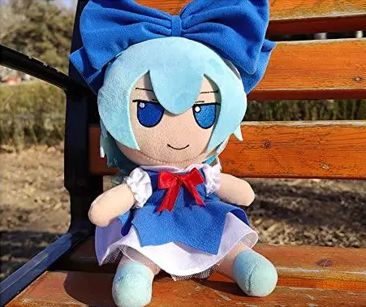
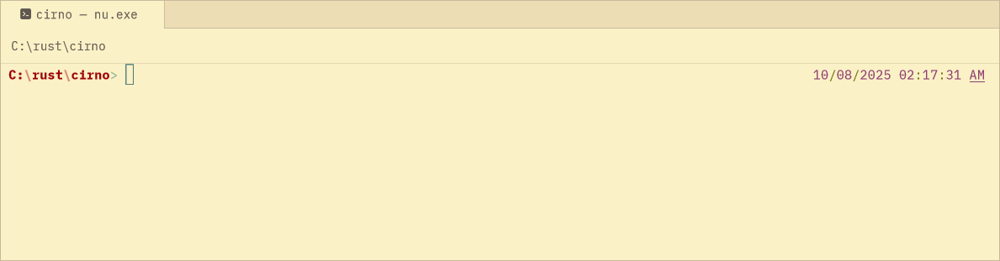

# Cirno 💙

**Language:** [English](./README.md) | [Русский](./README_RU.md)

---

## English

<div align="center">



*She will always support you.*

A command-line application that displays random motivational phrases in Japanese and Russian to brighten your day.

### Framed (default)


### Compact


[](https://crates.io/crates/cirno)
[](https://opensource.org/licenses/MIT)
[](https://www.rust-lang.org)

</div>

## Features

- 🎲 **Random Phrases**: Get a random motivational phrase from a collection of 323+ entries
- 🌸 **Bilingual Support**: Each phrase is available in both Japanese and Russian
- 🎨 **Multiple Display Modes**: Choose between framed and compact output formats
- 🌍 **Language Filtering**: Show only Japanese, only Russian, or both languages
- 💻 **Terminal Aware**: Automatically adapts to your terminal width

## Installation

### Using Cargo (Recommended)

```bash
cargo install cirno
```

### From Source

Make sure you have Rust installed, then:

```bash
git clone https://github.com/TOwInOK/cirno.git
cd cirno
cargo build --release
```

The binary will be available at `target/release/cirno`.

## Integrate
### nushell (nu)
- open your config
```
config nu
```
- add code like that to the end
```
# for direct path
let cirno_path = "path_to_cirno"
^$cirno_path # or with -d compact

# if app instaled or linked to the system
# for compact
cirno -d compact
# for framed
cirno
```

## Usage

```bash
cirno [OPTIONS]
```

### Options

- `-s, --show <TYPE>` - Choose which language to display:
  - `all` (default) - Show both Japanese and Russian
  - `japan` - Show only Japanese text
  - `russina` - Show only Russian text
- `-d, --display <TYPE>` - Choose output display format:
  - `framed` (default) - Display with decorative frame
  - `compact` - Display in minimal format

### Examples

**Default framed output:**
```
==================================
||                              ||
||          諦めないで             ||
||                              ||
||         Не сдавайся          ||
||                              ||
==================================
```

**Compact output:**
```bash
cirno --display compact
# or
cirno -d compact
```
```
大丈夫です
Всё будет хорошо
```

**Japanese only:**
```bash
cirno --show japan
# or
cirno -s japan
```
```
==================================
||                              ||
||          頑張って！            ||
||                              ||
==================================
```

**Russian only with compact format:**
```bash
cirno --show russina --display compact
# or
cirno -s russina -d compact
```
```
Всё получится!
```

## Project Structure

This project consists of two main components:

- **`cirno`** - The main CLI application
- **`cirno_store`** - A library containing the phrase database and selection logic

## Dependencies

- [clap](https://crates.io/crates/clap) - Command line argument parsing
- [colored](https://crates.io/crates/colored) - Terminal color output
- [terminal_size](https://crates.io/crates/terminal_size) - Terminal dimensions detection
- [unicode-width](https://crates.io/crates/unicode_width) - Unicode string width calculation
- [tinyrand](https://crates.io/crates/tinyrand) - Fast random number generation
- [getrandom](https://crates.io/crates/getrandom) - Cryptographically secure random number generation

## Development

### Building

```bash
cargo build
```

### Running Tests

```bash
cargo test
```

### Running in Development

```bash
cargo run -- --help
```

## Contributing

Contributions are welcome! Please feel free to submit a Pull Request. Whether it's:

- Adding new motivational phrases
- Improving the display formatting
- Adding new languages
- Bug fixes
- Documentation improvements

## License

This project is licensed under the MIT License - see the [LICENSE](LICENSE) file for details.

## Acknowledgments

- Inspired by the character Cirno from the Touhou series
- Built with ❤️ using Rust
- Special thanks to all contributors of motivational phrases

---

*Remember: No matter what challenges you face today, Cirno believes in you! 💪*
